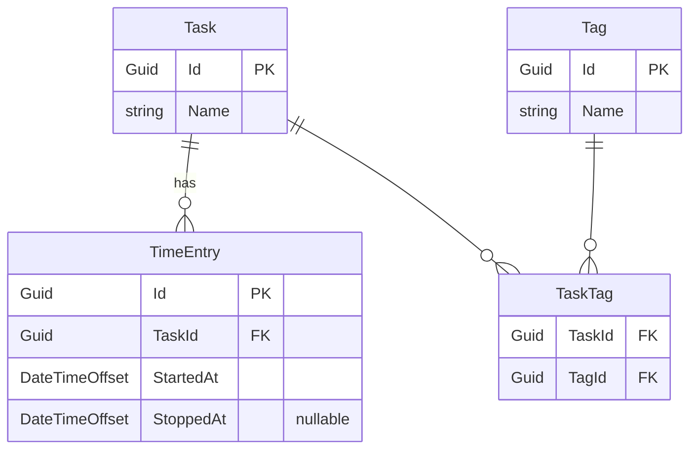

# Domain Model

Плоская структура: **Task** — центр. Теги — поперечный срез. Никакой иерархии.

## Сущности

### Task
Именованная единица работы. Создаётся один раз, запускается многократно.

| Поле | Тип | Описание |
|---|---|---|
| Id | Guid | PK |
| Name | string | Название задачи |

### Tag
Метка для поперечной классификации.

| Поле | Тип | Описание |
|---|---|---|
| Id | Guid | PK |
| Name | string | Название метки |

### TimeEntry
Одна запись времени (интервал). Создаётся при нажатии «Старт».

| Поле | Тип | Описание |
|---|---|---|
| Id | Guid | PK |
| TaskId | Guid | FK → Task |
| StartedAt | DateTimeOffset | Начало |
| StoppedAt | DateTimeOffset? | Конец; `null` = таймер активен |

Связь Task ↔ Tag — многие-ко-многим через join-таблицу `TaskTag`.

---

## ER-диаграмма

---

## Намеренно исключено

| Сущность | Причина |
|---|---|
| Project | Избыточная иерархия; задачи плоские, теги достаточны |
| Note | Лишнее поле; один клик = запуск/стоп, никаких форм |
| User / Auth | Вне scope pet-проекта |
| Report | Это View, не сущность |
